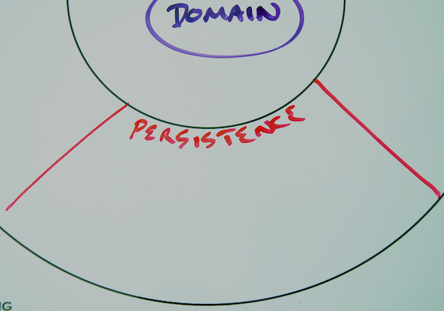
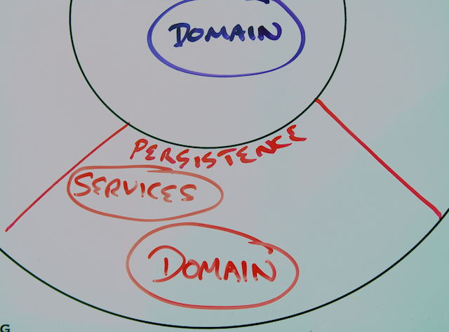

# Step 2: Storing Menu Data Using MongoDB

As you dive into writing code in this tutorial, the assumption is that The Yummy Noodle Bar application core has been implemented. You are now tackling the task of extending it to store data.

> **Note:** The implemented application core is what can be found in the **initial** code drop as mentioned at the [beginning of this tutorial](../#downloading-and-running-the-code).

For this section, you will work within the Persistence domain to add this functionality:



In that domain you have a representation of `MenuItem` optimised for persistence that is contained in the Domain sub-domain:


In order for the Core Domain to send events to the Persistence Domain, you also have a Services sub-domain provided in the Persistence domain:



Inside the Persistence Domain's Service sub-domain, there is an event handler `MenuPersistenceEventHandler`, exchanging events with the application core, and the repository `MenuItemRepository` whose responsibility is to persist and retrieve MenuItem data for the rest of the application.

In this step you will implement `MenuItemRepository` using Spring Data MongoDB and integrate this with the `MenuPersistenceEventHandler`.

## About MongoDB

[MongoDB](http://www.mongodb.org) is a document-oriented database that stores data natively in a document format called [BSON (Binary JSON)](http://en.wikipedia.org/wiki/BSON). This is similar in structure to [JSON](http://en.wikipedia.org/wiki/JSON), and is ultimately derived from it.

MongoDB does not enforce a schema or document structure beyond the concept of a *Collection*, which contains a set of documents.

Querying can be performed over the whole document structure, although Joins between Collections is not part of the document model.

Large scale data transformation and analysis is a native part of MongoDB, and can be performed either declaratively or with JavaScript functions as part of a [MapReduce](http://en.wikipedia.org/wiki/MapReduce) implementation.

## Install MongoDB

Before continuing it's worthwhile ensuring that you have MongoDB installed correctly.

If you don't have it installed already, visit the [Mongo DB Project](http://www.mongodb.org) and follow the instructions to install MongoDB.  

> **Note:** Do not set up any authentication.

After you have installed MongoDB, launch the MongoDB database daemon using the following command:

```sh
$ mongod
```
You should then see an output that is something like the following:

```
all output going to: /usr/local/var/log/mongodb/mongo.log
```
Now launch the command-line client with:

```sh
$ mongo
```

You should then see a prompt that contains something like the following:

```
MongoDB shell version: 2.0.8
connecting to: test
>
```

Congratulations, MongoDB seems to be alive and healthy! You are now all set to develop your Mongo-centric Persistence Domain components.

## Import Spring Data MongoDB

Import **spring-data-mongodb** into your project by adding it to your `build.gradle` list of dependencies:

    <@snippet "build.gradle" "deps" "/complete" />

## Start with a (failing) test: Introducing MongoTemplate

Before you can implement the Repository, you have to build something that will use it. In this case, you will start by writing a simple test case that attempts to store a `MenuItem` using `MongoTemplate`.

`MongoTemplate` is one of the core classes provided by [Spring Data Mongo](http://www.springsource.org/spring-data/mongodb).  It follows the familiar [Template Method pattern](http://en.wikipedia.org/wiki/Template_method_pattern) that is used extensively in other parts of Spring, such as `JmsTemplate`, `JdbcTemplate` and `RestTemplate`. 


With respect to MongoDB, MongoTemplate does the leg work of connecting to a MongoDB server and managing the necessary resources involved, while also exposing a simple API that provides a large amount of functionality.

Test Driven Development guides you to test the smallest piece of the system you can, and then build your tests outwards from that. This builds confidence in the system as a whole.

The smallest piece in this case is the Persistence domain class, `MenuItem`.  It will contain mapping and configuration information describing how it should be persisted into the database.

There is an existing helper class, `com.yummynoodlebar.persistence.domain.fixture.PersistenceFixture`, and now that you have imported Spring Data Mongo, you can create another `com.yummynoodlebar.persistence.domain.fixture.MongoAssertions`

They provide some methods we can use to make our tests a bit more readable.

Create the class `com.yummynoodlebar.persistence.domain.fixture.MongoAssertions` with the content 

    <@snippet path="src/test/java/com/yummynoodlebar/persistence/domain/fixture/MongoAssertions.java" prefix="/complete" />

Next, create a test called `MenuItemMappingIntegrationTests` that contains the following:

    <@snippet "src/test/java/com/yummynoodlebar/persistence/integration/MenuItemMappingIntegrationTests.java" "top" "/complete" />

This is a simple usage of `MongoTemplate` that uses the `persistence.domain.MenuItem` class to push data into and out of a Mongo Collection. This test class will verify that `MenuItem` works as expected against a real, running MongoDB instance.

The test ensures that the mapping works as expected and the document appears in the expected shape in the collection. It also tests that the indexes that you expect
have also been initialised.

Run this test and it will fail as the mapping is not as expected, the collection being used is wrong, and the indexes are not being fully created.

It's now time to alter your domain class to ensure it persists correctly.

Open `com.yummynoodlebar.persistence.domain.MenuItem`, and add the annotations @Document, @Id and @Indexed to bring the domain into line with the test expectations.

    <@snippet "src/main/java/com/yummynoodlebar/persistence/domain/MenuItem.java" "top" "/complete"/>

This alters the collection name to be *menu* (instead of *MenuItem*), ensures that the field *id* is used as the Mongo document *_id* and that the field *name* is stored as *itemName* and is also indexed.

None of these annotations are necessary. A bare [POJO](http://en.wikipedia.org/wiki/Plain_Old_Java_Object) can be passed to `MongoTemplate` and it will apply its default behaviour.  Here you've altered that default behaviour using the mapping annotations on the persistence entity to make your test pass.

## Implement a CRUD repository

`MenuItem` is now ready to be persisted.  We could write an implementation of `MenuItemRepository` using `MongoTemplate` but Spring Data gives us a better option: It can create an implementation of the Repository interface for us at runtime.

You first need to update `MenuItemRepository` into something that Spring Data can handle.

Before you do that though, you need a (failing) test again!

Create a new component in the application'c Config Domain called `com.yummynoodlebar.config.MongoConfiguration`, leaving it empty for now.

Next, you need Spring Test support, add into your `build.gradle` dependencies :

    <@snippet "build.gradle" "testDeps" "/complete" />

Then create a test that contains the following:

    <@snippet  path="src/test/java/com/yummynoodlebar/persistence/integration/MenuItemRepositoryIntegrationTests.java" prefix="/complete"/>

The test will now fail, and so it's time to implement your repository.

Open `com.yummynoodlebar.persistence.repository.MenuItemRepository` and make it contain the following:

    <@snippet path="src/main/java/com/yummynoodlebar/persistence/repository/MenuItemRepository.java" prefix="/complete"/>

`CrudRepository` is part of the Spring Data repository hierarchy. It acts as both a marker interface and it adds several key methods to provide us with a living, breathing implementation of a repository, with almost zero code.

Everything will still compile in the project, however the test will still not pass.

Open `MongoConfiguration` again, and alter it to read like the following:

    <@snippet path="src/main/java/com/yummynoodlebar/config/MongoConfiguration.java" prefix="/complete"/>

`@Configuration` marks the class as a Spring Configuration/Java Config class, able to generate part of a Spring ApplicationContext.

`@EnableMongoRepositories` is part of Spring Data Mongo, and works to construct the repository implementation. 

The values passed into the annotation select the class(es) that we want to be considered as repositories. In this case, only `MenuItemRepository` is to be considered and so it is referred to explicitly.

The guts of the configuration deal with connecting to MongoDB. It creates a Mongo driver connection and a `MongoTemplate` to wrap it.

The auto generated Repositories use the `MongoTemplate` created here to connect to MongoDB.

Run the test again and now it should pass cleanly.

Congratulations!  You have a working Repository, without having to explicitly implement it yourself.

At this point your repository only implements [CRUD (Create, Read, Update, Delete) operations](http://en.wikipedia.org/wiki/Create,_read,_update_and_delete). Is that enough?

## Extend your Repository with a Custom Finder

A late breaking requirement has been uncovered! Does that sound familiar...

Users are going to be given the opportunity to select dishes by the names of the ingredients that they contain.

Looking at MenuItem, the document that is stored in MongoDB will look similar to the following:

```json
{
        "_id" : ObjectId("520d388bea7e3adc2a054886"),
        "_class" : "com.yummynoodlebar.persistence.domain.MenuItem",
        "ingredients" : [
                {
                        "name" : "Noodles",
                        "description" : "Crisp, lovely noodles"
                },
                {
                        "name" : "Peanuts",
                        "description" : "A Nut"
                }
        ],
        "cost" : "12.99",
        "minutesToPrepare" : 0
}
```

A search based on ingredients will require querying deep inside the document structure to correctly identify the matching documents.

Before you do anything else, let's write a test that attempts to do this type of search:

    <@snippet path="src/test/java/com/yummynoodlebar/persistence/integration/MenuItemRepositoryFindByIngredientsIntegrationTests.java" prefix="/complete"/>

This assumes a method named `findByIngredientsNameIn` in your repository. 

How do you implement that method? Spring Data does it for you! You already have the method signature in the interface.

`standardItem()` has peanuts, `eggFriedRice()` doesn't.  So we should see just two documents come back from the query.

Try running the test....  it passes, right?

Spring Data has generated an implementation of this method, doing what you wanted. Spring Data relies on a rich vocabulary that you can express using method names in order to trigger auto-generation of these search methods on your repositories, see more in the [reference documentation](http://static.springsource.org/spring-data/data-mongodb/docs/current/reference/html/mongo.repositories.html#mongodb.repositories.queries).

## Extend the Repository with Map/Reduce

A more interesting requirement would be helping the user look up the ingredients used in the most dishes. MongoDB provides a system to perform this kind of analysis, MapReduce.

To use MapReduce, you need to gain access to the `MongoTemplate` directly and add this into the Repository that Spring Data is currently managing for you.

Open the interface `com.yummynoodlebar.persistence.repository.AnalyseIngredients`:

    <@snippet path="src/main/java/com/yummynoodlebar/persistence/repository/AnalyseIngredients.java" prefix="/complete"/>

Next, update `MenuItemRepository` to include the `AnalyseIngredients` interface. This indicates to Spring Data that it should look for an implementation of that interface for extension.

Next, create a test class that looks for this new functionality called `MenuItemRepositoryAnalyseIngredientsIntegrationTests`:

    <@snippet path="src/test/java/com/yummynoodlebar/persistence/integration/MenuItemRepositoryAnalyseIngredientsIntegrationTests.java" prefix="/complete"/>

This sets up some known test data and calls the analysis method, expecting certain ingredients in known relative quantities.

We can now write an implementation of this new interface. Create an implementation of this interface `com.yummynoodlebar.persistence.repository.MenuItemRepositoryImpl`. 

The name of this class `MenuItemRepositoryImpl` is very important! This marks it out as an *extension* of the repository named `MenuItemRepository`, and is automatically component scanned, instantiated and used as a delegate by Spring Data.

    <@snippet path="src/main/java/com/yummynoodlebar/persistence/repository/MenuItemRepositoryImpl.java" prefix="/complete"/>

This class references two JavaScript functions, the mapper and the reducer, respectively.

Create 2 new JavaScript files, in the src/main/resources directory:

    <@snippet path="src/main/resources/ingredientsmap.js" prefix="/complete"/>

    <@snippet path="src/main/resources/ingredientsreduce.js" prefix="/complete"/>

> **Note:** If you are using an IDE to run the tests, such as STS, you may need to update its compilation configuration to include *.js files.

The test should now pass successfully. You can run all the tests by typing the following at the command line:

```sh
$ ./gradlew test
```

## Summary

You have created a custom data analysis task against MongoDB. Interacting with MongoDB didn't require a whole lot of effort, thanks to Spring Data Mongo.

You've also added configuration to drive the MongoDB infrastructure by adding a new configuration component into your Configuration domain.

You now have your first repository that is contained in your new Repository sub-domain in your Persistence domain that houses the repository components responsible for storing and retrieving data. The new Repository sub-domain is shown in the Life Preserver below:


Your full Life Preserver diagram should look like the following now:


Now that the Menu data is safely stored in Mongo its time to turn your attention to storing and retrieving Orders using a whole different data model and data storage technology … JPA.

[Next… Storing Order Data using JPA](../3/)