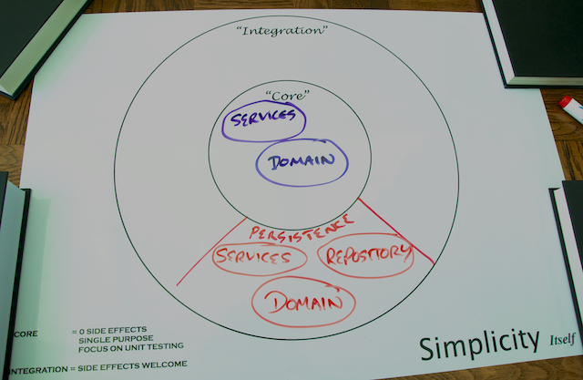

# Step 3: Storing Order Data Using the Java Persistence API (JPA)

You're already happily storing `MenuItem` data with the components shown on the following diagram:



Your next task for the Yummy Noodle Bar persistence project is to store Order data. Yummy Noodle Bar has decided to use [PostgreSQL](http://www.postgresql.org) to store this data, a freely available, robust, relational database.

Continuing from the [last section](../2/), your focus will be on developing components within the Persistence domain.

In that domain you have a component that represents an Order, `com.yummynoodle.persistence.domain.Order` that you can optimise for persistence without affecting the rest of your application.

There is an event handler, `OrderPersistenceEventHandler`, that exchanges events between the application core and the repository `OrdersRepository`. The repository's responsibility is to persist and retrieve Order data for the rest of the application.

You will implement `OrdersRepository` using Spring Data JPA and integrate this with the `OrderPersistenceEventHandler`.

## A Word on JPA

[JPA](http://www.oracle.com/technetwork/java/javaee/tech/persistence-jsp-140049.html) is the standard Java mechanism for working with relational databases. JPA provides an API to map Java Objects to relational concepts and comes with a rich vocabulary for querying across these objects, transparently translating to SQL (most of the time).

Since JPA is a standard there are many implementations referred to as JPA *Providers*.

For this tutorial, you will use [Spring Data JPA](http://projects.spring.io/spring-data-jpa/) along with [Hibernate](http://www.hibernate.org) as the JPA provider.

## Using H2 as an in memory database for Testing

PostgreSQL is a fully functional database that is suitable for production. However for testing, a lighter, embedded database is suitable. You will use [H2](http://www.h2database.com) for development purposes during this tutorial. H2 allows the easy creation and destruction of database instances in a lifecycle controlled by a test.

The JPA standard provides enough of an abstraction that you may use different databases in production and development. 

We recommend to test application integration with the production database in addition to the interaction tests run against H2. This would normally be part of your minimal set of acceptance or 'smoke' tests.
    
## Importing Spring Data JPA

Import Spring Data JPA and the Hibernate JPA Provider into your project by adding it to the build.gradle 's list of dependencies:

    <@snippet "build.gradle" "deps" "/complete" />

In the above code you can also see the dependencies for H2.

## Start with a (failing) test: Introducing JPA

Following the pattern from the previous section, first create a test to drive your development that checks that the persistence mapping class correctly stores and retrieves records.

First, create a placeholder configuration class `com.yummynoodlebar.config.JPAConfiguration`.

Next, create a helper class `com.yummynoodlebar.persistence.domain.fixture.JPAAssertions`, similar to the `MongoAssertions` in the previous section; This uses both Hibernate and JDBC to inspect what has been done to the database schema. It does this to provide a set of test methods that make your tests to more readable and show their intent that much more clearly.

    <@snippet path="src/test/java/com/yummynoodlebar/persistence/domain/fixture/JPAAssertions.java" prefix="complete"/>

Finally, create the new test class `OrderMappingIntegrationTests`:

    <@snippet path="src/test/java/com/yummynoodlebar/persistence/integration/OrderMappingIntegrationTests.java" prefix="complete"/>

This test checks that `com.yummynoodle.persistence.domain.Order` correctly maps to the JPA wrapped database (H2).  

It is important to have an understanding of how your object is being mapped against the database and test that it meets your expectations. If you know how and why the mapping is occurring you can create indexes and other optimisations and be safe in the knowledge that the data is where you expect it to be. You may also access the data outside of the JPA provider, directly querying the database.

This test is making use of an existing helper class `JPAAssertions` .

    <@snippet "src/test/java/com/yummynoodlebar/persistence/integration/OrderMappingIntegrationTests.java" "assertion"  "complete"/>

This line captures the expectation that the table `NOODLE_ORDERS` exists. This is followed by the checks that assert the appropriate column structure. 

If required, these tests could be extended to further check the schema definition to ensure that the data is being mapped as expected.

This test will not pass yet as the JPA infrastructure needed to connect `Order` with the database has not been set up. To handle that, create a new configuration component in your application's Config domain called`JPAConfiguration` with the following settings:

    <@snippet path="src/main/java/com/yummynoodlebar/config/JPAConfiguration.java" prefix="complete"/>

The method `DataSource dataSource()` creates the embedded H2 database.  This creates a new H2 instance within the same ApplicationContext and provides a DataSource interface to it, usable by JPA.

The method `EntityManagerFactory entityManagerFactory()` creates the `EntityManagerFactory`.  This class is responsible for creating the `EntityManager`, and is *JPA Provider specific*. In this case, this shows the creation and setup of a Hibernate JPA Provider, including the provision of the datasource `dataSource()`.

The EntityManagerFactory is responsible for identifying the JPA Entities to be made available, the classes to be treated as database mapping/ persistence beans.

The method `EntityManager entityManager()` creates the core class of JPA.  `EntityManager` is the public interface of JPA, providing methods to persist, delete, update and query, and is used in the tests below for this purpose.

`transactionManager()` initialises the JPA transaction manager. This integrates with the declarative Transaction Management features of Spring, permitting the use of @Transactional and associated classes and configuration, for more information, [click here](http://static.springsource.org/spring/docs/3.2.4.RELEASE/spring-framework-reference/html/transaction.html)

Spring provides an exception translation framework to translate exceptions from many different sources into a consistent set that your application can use. In this case, the JPA Configuration expects a bean that provides these translations, which is provided by `hibernateExceptionTranslator()`

The test will now run without compilation or runtime errors but will fail as the JPA entity is not set up.

Update `com.yummynoodle.persistence.domain.Order` to contain the following:

    <@snippet path="src/main/java/com/yummynoodlebar/persistence/domain/Order.java" prefix="complete"/>

`@Entity(name = "NOODLE_ORDERS")` declares this class as a JPA *Entity*. This is a class that is mapped to a database and able to be consumed by `EntityManager`.

`@Column(name = "SUBMISSION_DATETIME")` is a JPA customisation that alters the name of the column this field will be mapped to. The default is the name of the field converted from lower camel (aFieldName) to uppsercase underscore case (A_FIELD_NAME)

```java
  @ElementCollection(fetch = FetchType.EAGER, targetClass = java.lang.Integer.class)
  @JoinTable(name="ORDER_ORDER_ITEMS", joinColumns=@JoinColumn(name="ID"))
  @MapKeyColumn(name="MENU_ID")
  @Column(name="VALUE")
```

This mapping is used to create a joined table, ORDER_ORDER_ITEMS, that contains the data stored in the java.util.Map.

`@Transient` informs JPA that the given field should not be stored in the database, and is analogous to the Java *transient* keyword 

Finally `@Id` indicates to both JPA and Spring Data that the given field(s) is the Primary Key, and should be used to both index and provide the default access method for the Entity.

Run your tests again and they will now pass, indicating that the mapping is all working as expected.

## Implement a CRUD repository

Now that your JPA Order entity is working properly, you can now implement a repository to work with your entity. 

Taking the same approach that you applied earlier for MongoDB, Spring Data provides a way to automatically create JPA backed repositories and fully fledged queries given only an interface as a starting point.

Create a new test class to test the repository that you've not written yet:

    <@snippet path="src/test/java/com/yummynoodlebar/persistence/integration/OrdersRepositoryIntegrationTests.java"  prefix="complete"/>

The following section is new:

    <@snippet "src/test/java/com/yummynoodlebar/persistence/integration/OrdersRepositoryIntegrationTests.java" "transactional" "complete"/>

These annotations integrate with the Spring declarative transaction management. The annotations state that every method on this class must be wrapped with a transaction and that the transaction should be, by default, rolled back on method completion. 

> **Note:** If you aren't familiar with database transactions they are a means to combine multiple database operations into a single, logical and atomic action. Either all the steps inside the transaction succeed or, upon any failure, are rolled back to the state before the transaction was started.

Spring transactions provide an incredibly convenient way to construct tests against a database by letting you automatically wrap a test method inside a transaction. Inside the test method, you update the database, reading and writing as your test requires. At the end of the test the transaction will be rolled back and the data discarded leaving a fresh environment for the next test to execute.

Your test requires an instance of `OrdersRepository` and saves several Order instances to it before calling a `findById` method. This will fail, as the implementation of `OrdersRepository` does not yet exist.

To solve this, update `JPAConfiguration` to enable the JPA Repository system. The desired repository is selected explicitly as multiple data sources/Spring Data configurations are being used.

    <@snippet "src/main/java/com/yummynoodlebar/config/JPAConfiguration.java" "transactions" "complete"/>
    
Then replace the contents of `OrdersRepository` to extend the Spring Data `CrudRepository`:

    <@snippet "src/main/java/com/yummynoodlebar/persistence/repository/OrdersRepository.java" "top" "complete"/>

The test will now pass correctly indicating that an implementation of `OrderRepository` is being created at runtime by Spring Data JPA and works as expected.

## Extend the Repository with a Custom Finder

Users need to be able to find Orders that contain certain menu items by Menu Item ID.

Create a new test `OrdersRepositoryFindOrdersContainingTests` to look for this new functionality:

    <@snippet path="src/test/java/com/yummynoodlebar/persistence/integration/OrdersRepositoryFindOrdersContainingTests.java" prefix="complete"/>

Once again, this test is a transactional database test that indicates that the database will roll back any changes on test conclusion. The test saves a set of orders and performs two queries using a method `findOrdersContaining` that will accept a menu item ID.

Open the repository and update it with the new search method:

    <@snippet "src/main/java/com/yummynoodlebar/persistence/repository/OrdersRepository.java" "query"  "complete"/>

This class uses a custom @Query. The annotation contains a SQL query, for which you have to set nativeQuery=true. Without `nativeQuery=true', the string in @Query is assumed to be a [JPA Query Language](http://en.wikipedia.org/wiki/Java_Persistence_Query_Language) query instead.

The full `OrdersRepository` class should now contain:

    <@snippet path="src/main/java/com/yummynoodlebar/persistence/repository/OrdersRepository.java"  prefix="complete"/>

Finally your test will now pass and the custom query is completed. You can run the entire test suite using Gradle:

```sh
$ ./gradlew test
```

## Summary

Order data is safely stored and retrievable using a JPA managed relational database. You've added an `OrdersRepository` component and a `JPAConfiguration` component to your application, as shown by the following Life Preserver diagram:


Next, you can see how to store OrderStatus data in the GemFire distributed data grid.

[Next…  Storing the Order Status in Gemfire using Spring Data GemFire](../4/)
