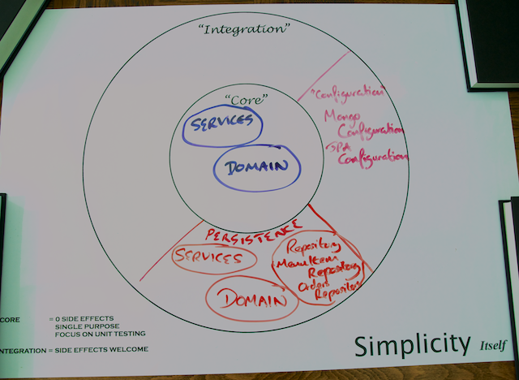

# Step 4: Storing the Order Status in GemFire using Spring Data GemFire

So far you are storing `MenuItem` data in MongoDB and `Order` data in PostgreSQL using Spring Data JPA as shown in the Life Preserver below:



Now it's time to look at how the status of your various orders will be stored, and for that task you're going to use GemFire.

These statuses will be coming into the application from the kitchen and order processing side of the business as opposed to the orders themselves that will come from the system that accepts orders from clients.

## A Word on GemFire

[Pivotal GemFire](http://gopivotal.com/pivotal-products/pivotal-data-fabric/pivotal-gemfire) is a high-performance distributed data grid. It scales from a small embedded cache implementation to large-scale wide area network implementations with data residency and access control.

[Spring Data GemFire](http://projects.spring.io/spring-data-gemfire/) allows the creation of both server and client connections, data access, caching and deep integration with the Spring Application Context.

In this step you will create a Spring Data interface to a GemFire server and then extend this our to use Continuous Queries.

## Import Spring Data GemFire

Add the following to your list of repositories in your build.gradle:

`build.gradle`
```gradle
  maven { url 'http://repo.springsource.org/libs-release'}
```

The following to your list of dependencies:

`build.gradle`
```gradle
  compile 'org.springframework.data:spring-data-gemfire:1.3.2.RELEASE'
```

This Maven-style repository is required to access the GemFire libraries, which are not available from Maven Central.

## Run a GemFire Cache Server

In order to run the tests and perform GemFire development you need to have access to a GemFire server.

While it would be possible to download a full distribution for the purposes of this tutorial, instead you're going to set up a server within this project.

In build.gradle, add the following to the end of the file:

`build.gradle`
```gradle
task run(type: JavaExec) {
  description = 'Runs a simple Gemfire Cache Server'
  main = "com.yummynoodlebar.persistence.services.LocalGemfireServer"
  classpath = sourceSets.main.runtimeClasspath
  standardInput = System.in
}
```

Create a new XML file `cache-config.xml`:

`src/main/resources/server/cache-config.xml`
```xml
<?xml version="1.0" encoding="UTF-8"?>
<beans xmlns="http://www.springframework.org/schema/beans"
	xmlns:xsi="http://www.w3.org/2001/XMLSchema-instance"
	xmlns:cache="http://www.springframework.org/schema/cache"
	xmlns:gfe="http://www.springframework.org/schema/gemfire"
	xmlns:context="http://www.springframework.org/schema/context"
	xmlns:util="http://www.springframework.org/schema/util"
	xmlns:gfe-data="http://www.springframework.org/schema/data/gemfire"
	xsi:schemaLocation="http://www.springframework.org/schema/gemfire http://www.springframework.org/schema/gemfire/spring-gemfire.xsd
		http://www.springframework.org/schema/beans http://www.springframework.org/schema/beans/spring-beans.xsd
		http://www.springframework.org/schema/util http://www.springframework.org/schema/util/spring-util.xsd
		http://www.springframework.org/schema/cache http://www.springframework.org/schema/cache/spring-cache.xsd
		http://www.springframework.org/schema/data/gemfire http://www.springframework.org/schema/data/gemfire/spring-data-gemfire.xsd
		http://www.springframework.org/schema/context http://www.springframework.org/schema/context/spring-context.xsd">
    
    
    <gfe:cache properties-ref="gemfire-props"/>
    
    <util:properties id="gemfire-props">
        <prop key="log-level">warning</prop>
    </util:properties>
     
    <gfe:cache-server/>
     
    <gfe:replicated-region id="YummyNoodleOrder">
    </gfe:replicated-region>
</beans>
```

This configures a basic GemFire server and creates a *Region*, a logical partition within GemFire, that we have named 'YummyNoodleOrder'.

Lastly create the component that will drive your local GemFire server `LocalGemfireServer`:

`src/main/java/com/yummynoodlebar/persistence/services/LocalGemfireServer.java`
```java
package com.yummynoodlebar.persistence.services;

import org.springframework.context.ApplicationContext;
import org.springframework.context.support.ClassPathXmlApplicationContext;

import java.io.IOException;

/**
 * Creates a cache server in this process and adds some data to the cache
 * @author David Turanski
 *
 */
public class LocalGemfireServer {
  @SuppressWarnings("unchecked")
  public static void main(String[] args) throws IOException,
      InterruptedException {
    ApplicationContext context = new ClassPathXmlApplicationContext("server/cache-config.xml");

    System.out.println("Press <ENTER> to terminate the cache server");
    System.in.read();
    System.exit(0);
  }
}
```

You may now start a GemFire server (on port 40404) by running 

    ./gradlew run

This server will have access to the classpath of the project, most importantly the OrderStatus class. It is necessary for the GemFire server to have access to this class if we want to persist it within the grid.  

> **Note:** When you create a standalone GemFire grid you need to provide any classes you wish to persist within a jar file on the classpath of every GemFire server.

## Start with a (failing) test: Introducing GemFireTemplate

In a similar way as with MongoDB and JPA, the first test you need to write checks that `OrderStatus` can be correctly persisted into GemFire.

Create a new test `OrderStatusMappingIntegrationTests` with the following content:

`src/test/java/com/yummynoodlebar/persistence/integration/OrderStatusMappingIntegrationTests.java`
```java
package com.yummynoodlebar.persistence.integration;

import com.gemstone.gemfire.GemFireCheckedException;
import com.gemstone.gemfire.GemFireException;
import com.gemstone.gemfire.cache.Region;
import com.yummynoodlebar.config.GemfireConfiguration;
import com.yummynoodlebar.persistence.domain.OrderStatus;
import com.yummynoodlebar.persistence.domain.fixture.PersistenceFixture;
import org.junit.After;
import org.junit.Before;
import org.junit.Test;
import org.junit.runner.RunWith;
import org.springframework.data.gemfire.GemfireCallback;
import org.springframework.data.gemfire.GemfireOperations;
import org.springframework.test.context.ContextConfiguration;
import org.springframework.test.context.junit4.SpringJUnit4ClassRunner;

import javax.annotation.Resource;

import java.util.UUID;

import static junit.framework.TestCase.assertEquals;

@RunWith(SpringJUnit4ClassRunner.class)
@ContextConfiguration(classes = {GemfireConfiguration.class})
public class OrderStatusMappingIntegrationTests {

  @Resource(name = "yummyTemplate")
  GemfireOperations yummyTemplate;

  @Before
  public void setup() {
    clear();
  }
  @After
  public void teardown() {
    clear();
  }
  public void clear() {
    yummyTemplate.execute(new GemfireCallback<Object>() {
      @Override
      public Object doInGemfire(Region<?, ?> region) throws GemFireCheckedException, GemFireException {
        region.clear();
        return "completed";
      }
    });
  }

  @Test
  public void thatItemCustomMappingWorks() throws Exception {
    OrderStatus status = PersistenceFixture.startedCooking(UUID.randomUUID());

    yummyTemplate.put(4L, status);

    OrderStatus results = yummyTemplate.findUnique("SELECT * from /YummyNoodleOrder");

    System.out.println("Found " + results.getId());

    assertEquals(status.getId(), results.getId());
    assertEquals(status.getOrderId(), results.getOrderId());
    assertEquals(status.getStatus(), results.getStatus());
  }
}
```

This test uses `GemFireTemplate`, seen in this test via its API interface `GemFireOperations`.  This follows the same pattern as other Spring Template classes, exposing the most common operations using consistent, simple methods, and also providing access to the low level GemFire API in a managed way through the use of callbacks.

You can see the access to the low level GemFire API in the `clear()` method. This accesses the Region instance and clears it of all data. Region implements the Map interface as it is also conceptually a Map. GemFire provides many features around this core concept and you can see the map usage in the test method itself:

`src/test/java/com/yummynoodlebar/persistence/integration/OrderStatusMappingIntegrationTests.java`
```java
    yummyTemplate.put(4L, status);
```

`GemFireTemplate` exposes a Map-oriented method to interact with its configured region.

The test inserts a single `OrderStatus` into the GemFire Region and then performs a query, using the GemFire [Object Query Language (OQL)](http://en.wikipedia.org/wiki/Object_Query_Language).  

GemFire OQL is a declarative language similar to the JPA Query Language and Hibernate Query Languages and provides a syntax to query against a set of Objects and their properties and perform selections, ordering, grouping and projections against the results.

Now that a test is in place, implement the configuration for your GemFire infrastructure by creating a new component in the Configuration domain called `GemFireConfiguration` with the following content:

`src/main/java/com/yummynoodlebar/config/GemfireConfiguration.java`
```java
package com.yummynoodlebar.config;

import com.yummynoodlebar.persistence.repository.OrderStatusRepository;
import org.springframework.context.annotation.ComponentScan;
import org.springframework.context.annotation.Configuration;
import org.springframework.context.annotation.FilterType;
import org.springframework.context.annotation.ImportResource;
import org.springframework.data.gemfire.repository.config.EnableGemfireRepositories;
import org.springframework.transaction.annotation.EnableTransactionManagement;

@Configuration
@ImportResource({"classpath:gemfire/client.xml"})
@EnableTransactionManagement
@EnableGemfireRepositories(basePackages = "com.yummynoodlebar.persistence.repository",
    includeFilters = @ComponentScan.Filter(value = {OrderStatusRepository.class}, type = FilterType.ASSIGNABLE_TYPE))
public class GemfireConfiguration {


}
```

This class is mainly used, at the moment, to allow the consistent use of Spring Java Configuration in tests and other context creation.

The main line to focus on in the configuration at this point is shown below:

`src/main/java/com/yummynoodlebar/config/GemfireConfiguration.java`
```java
@ImportResource({"classpath:gemfire/client.xml"})
```

This imports a traditional XML based Spring configuration.  Currently Spring Data GemFire is significantly easier to configure using XML. For this reason, XML configuration is still recommended for Spring Data GemFire.

Next create a GemFire client configuration file:

`src/main/resources/gemfire/client.xml`
```xml
<?xml version="1.0" encoding="UTF-8"?>
<beans xmlns="http://www.springframework.org/schema/beans"
       xmlns:xsi="http://www.w3.org/2001/XMLSchema-instance" xmlns:cache="http://www.springframework.org/schema/cache"
       xmlns:gfe="http://www.springframework.org/schema/gemfire"
       xmlns:context="http://www.springframework.org/schema/context"
       xmlns:tx="http://www.springframework.org/schema/tx"
       xmlns:gfe-data="http://www.springframework.org/schema/data/gemfire"
       xsi:schemaLocation="http://www.springframework.org/schema/gemfire http://www.springframework.org/schema/gemfire/spring-gemfire.xsd
        http://www.springframework.org/schema/tx http://www.springframework.org/schema/tx/spring-tx.xsd
		http://www.springframework.org/schema/beans http://www.springframework.org/schema/beans/spring-beans.xsd
		http://www.springframework.org/schema/cache http://www.springframework.org/schema/cache/spring-cache.xsd
		http://www.springframework.org/schema/data/gemfire http://www.springframework.org/schema/data/gemfire/spring-data-gemfire.xsd
		http://www.springframework.org/schema/context http://www.springframework.org/schema/context/spring-context.xsd">

    <tx:annotation-driven/>

    <gfe-data:datasource subscription-enabled="true">
        <gfe-data:server host="localhost" port="40404" />
    </gfe-data:datasource>

    <bean id="yummyTemplate" class="org.springframework.data.gemfire.GemfireTemplate">
        <property name="region" ref="YummyNoodleOrder"/>
    </bean>

    <gfe:transaction-manager id="transactionManager"/>

    <!--<gfe-data:json-region-autoproxy/>   -->
    <!--<gfe:cq-listener-container>-->
        <!--<gfe:listener ref="cqListener"-->
                      <!--query="select * from /Order where customerId = 2" />-->
    <!--</gfe:cq-listener-container>-->

    <!--<bean id="cqListener" class="org.springframework.data.gemfire.examples.CQListener" />-->

</beans>
```

This configuration uses the GemFire Spring configuration namespace and creates a GemFire DataSource.  This is a connection to a GemFire data grid and is, in this case, connecting to the GemFire server running on localhost:40404.

The bean `yummyTemplate` is the instance of `GemFireTemplate` that is used in the test above. It is set up to communicate with a specific GemFire Region, YummyNoodleOrder, which must exist in the server.

The last two lines of configuration set up the GemFire transactional behaviour and integrate it with the Spring transaction management system.

## Implementing a CRUD repository

You have seen the creation of two Repository implementations against both MongoDB and JPA and the process for creating a Spring Data GemFire Repository will seem very familiar!

First, create a new test `OrderStatusRepositoryIntegrationTests`:

`src/test/java/com/yummynoodlebar/persistence/integration/OrderStatusRepositoryIntegrationTests.java`
```java
package com.yummynoodlebar.persistence.integration;


import com.yummynoodlebar.config.GemfireConfiguration;
import com.yummynoodlebar.persistence.domain.OrderStatus;
import com.yummynoodlebar.persistence.domain.fixture.PersistenceFixture;
import com.yummynoodlebar.persistence.repository.OrderStatusRepository;
import org.junit.After;
import org.junit.Before;
import org.junit.Test;
import org.junit.runner.RunWith;
import org.springframework.beans.factory.annotation.Autowired;
import org.springframework.test.context.ContextConfiguration;
import org.springframework.test.context.junit4.SpringJUnit4ClassRunner;

import java.util.Collection;
import java.util.List;
import java.util.UUID;

import static junit.framework.TestCase.assertEquals;
import static junit.framework.TestCase.assertNotNull;

@RunWith(SpringJUnit4ClassRunner.class)
@ContextConfiguration(classes = {GemfireConfiguration.class})
public class OrderStatusRepositoryIntegrationTests {

  @Autowired
  OrderStatusRepository ordersStatusRepository;

  @Before
  public void setup() {
    ordersStatusRepository.deleteAll();
  }

  @After
  public void teardown() {
    ordersStatusRepository.deleteAll();
  }

  @Test
  public void thatItemIsInsertedIntoRepoWorks() throws Exception {

    UUID key = UUID.randomUUID();

    OrderStatus orderStatus = PersistenceFixture.startedCooking(key);
    orderStatus.setId(key);

    ordersStatusRepository.save(orderStatus);

    OrderStatus retrievedOrderStatus = ordersStatusRepository.findOne(key);

    assertNotNull(retrievedOrderStatus);
    assertEquals(key, retrievedOrderStatus.getId());
  }
}
```

This test generates a new `OrderStatus` with a known key and passes it to `OrderStatusRepository` for persisting. It then retrieves the data using the method `findOne`, which will query against the *key* that is passed into the GemFire Region Map structure.

Data is being managed explicitly in the test rather than using the declarative transaction management that was introduced in the JPA tests. 

While GemFire does integrate with the Spring provided transactions, it only supports **Isolation.READ_COMMITTED**.  This means that once you write data, it cannot be read, by any thread or process, until the surrounding transaction is committed. Any test that wrote data within a transaction would be unable to read it until the transaction finished.

For this reason the test is not marked as @Transactional so all data access will not be transactionally managed within the tests. At the start and end of the test, the region is purged by using the repository `deleteAll` method generated by Spring Data.

To implement the Repository, update `OrderStatusRepository` to contain:

`src/main/java/com/yummynoodlebar/persistence/repository/OrderStatusRepository.java`
```java
package com.yummynoodlebar.persistence.repository;

import com.yummynoodlebar.persistence.domain.OrderStatus;
import org.springframework.data.gemfire.repository.GemfireRepository;
import org.springframework.data.gemfire.repository.Query;

import java.util.Collection;
import java.util.UUID;

public interface OrderStatusRepository extends GemfireRepository<OrderStatus, UUID> {

  @Query("SELECT DISTINCT * FROM /YummyNoodleOrder WHERE orderId = $1 ORDER BY statusDate")
  public Collection<OrderStatus> getOrderHistory(UUID orderId);
}
```

Update `GemFireConfiguration` to enable GemFire Repositories:

`src/main/java/com/yummynoodlebar/config/GemfireConfiguration.java`
```java
package com.yummynoodlebar.config;

import com.yummynoodlebar.persistence.repository.OrderStatusRepository;
import org.springframework.context.annotation.ComponentScan;
import org.springframework.context.annotation.Configuration;
import org.springframework.context.annotation.FilterType;
import org.springframework.context.annotation.ImportResource;
import org.springframework.data.gemfire.repository.config.EnableGemfireRepositories;
import org.springframework.transaction.annotation.EnableTransactionManagement;

@Configuration
@ImportResource({"classpath:gemfire/client.xml"})
@EnableTransactionManagement
@EnableGemfireRepositories(basePackages = "com.yummynoodlebar.persistence.repository",
    includeFilters = @ComponentScan.Filter(value = {OrderStatusRepository.class}, type = FilterType.ASSIGNABLE_TYPE))
public class GemfireConfiguration {


}
```

As with the other data stores, explicitly choose the Repository interface for Spring Data GemFire to implement. The entity/persistence class, in this case `OrderStatus`, requires annotating to control how it is persisted into the data store.

GemFire was built from the beginning to understand Java objects more thoroughly than either MongoDB or H2. This means that `OrderStatus` requires no additions to persist naturally into GemFire, as we saw above in `OrderStatusMappingIntegrationTests`.

Two things are needed for Spring Data to be able to generate a Repository implementation: configuring the default Region
 and specifying the property to use as the Region key/ID.

`src/main/java/com/yummynoodlebar/persistence/domain/OrderStatus.java`
```java
@Region("YummyNoodleOrder")
public class OrderStatus implements Serializable {

  private UUID orderId;
  @Id
  private UUID id;
```

It's time to test your integration with GemFire. First run the GemFire server:

```sh
$ ./gradlew run
```
    
Then run the test `OrderStatusRepositoryIntegrationTests` to check that the `OrderStatusRepository` is being correctly generated and works as expected. You can run this test inside your IDE, or run the entire test suite from another shell by typing:

```sh
$ ./gradlew test
```

## Extend the Repository with a Custom Finder

An Order has a history of the status updates made to it. A history is a list of `OrderStatus` objects in date order.

You now need a more complex query than simply by ID or Order ID. You'll also need to sort by date. 

Create a new test `OrderStatusGetHistoryIntegrationTests`:

`src/test/java/com/yummynoodlebar/persistence/integration/OrderStatusGetHistoryIntegrationTests.java`
```java
package com.yummynoodlebar.persistence.integration;

import com.yummynoodlebar.config.GemfireConfiguration;
import com.yummynoodlebar.persistence.domain.OrderStatus;
import com.yummynoodlebar.persistence.domain.fixture.PersistenceFixture;
import com.yummynoodlebar.persistence.repository.OrderStatusRepository;
import org.junit.After;
import org.junit.Before;
import org.junit.Test;
import org.junit.runner.RunWith;
import org.springframework.beans.factory.annotation.Autowired;
import org.springframework.test.context.ContextConfiguration;
import org.springframework.test.context.junit4.SpringJUnit4ClassRunner;

import java.util.ArrayList;
import java.util.List;
import java.util.UUID;

import static junit.framework.TestCase.assertEquals;
import static junit.framework.TestCase.assertNotNull;

@RunWith(SpringJUnit4ClassRunner.class)
@ContextConfiguration(classes = {GemfireConfiguration.class})
public class OrderStatusGetHistoryIntegrationTests {

  @Autowired
  OrderStatusRepository ordersStatusRepository;

  @Before
  public void setup() {
    ordersStatusRepository.deleteAll();
  }

  @After
  public void teardown() {
    ordersStatusRepository.deleteAll();
  }

  @Test
  public void thatGetHistoryWorks() throws Exception {

    UUID orderId = UUID.randomUUID();

    UUID key0 = ordersStatusRepository.save(PersistenceFixture.orderReceived(orderId)).getId();
    UUID key1 = ordersStatusRepository.save(PersistenceFixture.orderReceived(orderId)).getId();
    UUID key2 = ordersStatusRepository.save(PersistenceFixture.orderReceived(orderId)).getId();

    List<OrderStatus> history = new ArrayList<OrderStatus>(ordersStatusRepository.getOrderHistory(orderId));

    assertNotNull(history);
    assertEquals(3, history.size());
    assertEquals(key0, history.get(0).getId());
    assertEquals(key1, history.get(1).getId());
    assertEquals(key2, history.get(2).getId());
  }
}
```

This test creates a sequential history of a single order id, saves that list into GemFire, and then retrieves it using a new custom method.

Update the repository to read:

`src/main/java/com/yummynoodlebar/persistence/repository/OrderStatusRepository.java`
```java
package com.yummynoodlebar.persistence.repository;

import com.yummynoodlebar.persistence.domain.OrderStatus;
import org.springframework.data.gemfire.repository.GemfireRepository;
import org.springframework.data.gemfire.repository.Query;

import java.util.Collection;
import java.util.UUID;

public interface OrderStatusRepository extends GemfireRepository<OrderStatus, UUID> {

  @Query("SELECT DISTINCT * FROM /YummyNoodleOrder WHERE orderId = $1 ORDER BY statusDate")
  public Collection<OrderStatus> getOrderHistory(UUID orderId);
}
```

This looks similar to the JPA custom method, and the concept is the same. Create a new method and annotate it with a @Query, passing a string containing OQL to perform the query with.

This query selects the distinct elements from the YummyNoodleBar Region where the order is given and then orders by statusDate, which is a property on OrderStatus.

This test will now pass with the correct ordering of the history ordered by status date.

You can check it by running:

```sh
$ ./gradlew test
```

> **Note:** You must be running GemFire in another console with `./gradlew run` for the tests to pass.

## Summary

In this step you've added the functionality to store `OrderStatus` data using GemFire. 

TODO Updated Life Preserver coming as all Life Preserver diagrams are undergoing a re-write for legibility.

Now it's time to take advantage of GemFire Continuous Queries to extend your scalable, event-driven architecture to include the data store itself.

[Next…  Extending the Persistence Domain to Send Events](../5/)
