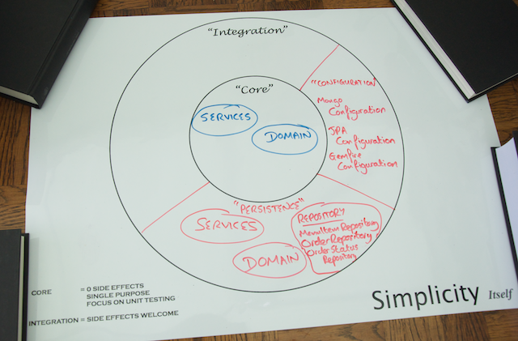

# Step 5: Extending the Persistence Domain to Send Events

The event handler and the repositories you have made that now make up the Persistence domain, as shown in the following Life Preserver diagram, will react to events and persist or retrieve data on demand.



Another team in the The Yummy Noodle Bar project is building a system to provide real-time notifications to clients (for example to a user on the website) while an order is being processed and cooked.

Complicating matters a bit further, the Yummy Noodle Bar application is to be deployed as a cluster for high availability and scalability. This means that a status update could be delivered on one application instance, while a client that should be notified is being managed by another instance.

To support this, you need to extend the Persistence domain to provide notifications across all application instances every time the status of an order is updated.

It's time to use the Continuous Query feature of GemFire to generate update notification events on every application instance when a modification is made.

## Data Grids and Continuous Queries

Usually an application would have to regularly poll to receive updated data from a data store. This is inefficient as many queries will be executed unnecessarily and also introduces latency in between polls. More often than not applications will likely introduce some separate messaging infrastructure, such as [RabbitMQ](http://rabbitmq.com), to distribute notifications.

GemFire is a distributed data grid. It can be clustered and provides a feature called Continuous Querying for just this circumstance.

Continuous Querying allows you to register a GemFire Query with the cluster and then for a simple POJO to receive events whenever a new piece of data is added that matches your query.
 
## Writing a continuous query

Whenever an OrderStatus instance is saved into GemFire, 
the method `OrderStatusUpdateService.setOrderStatus()` needs to be called with an appropriate event.

First, create a stub implementation of `OrderStatusUpdateService`. This stub will receive events and count them off against a [`CountDownLatch`](http://docs.oracle.com/javase/7/docs/api/java/util/concurrent/CountDownLatch.html) to ensure that the correct number of events are received in the given time. When all expected threads submit their countdown, the latch proceeds to completion.

    <@snippet path="src/test/java/com/yummynoodlebar/persistence/integration/fakecore/CountingOrderStatusService.java" prefix="complete" />

Next, create a new test-only Spring Configuration.  This will stand in the place of any Core domain Spring configuration.

    <@snippet path="src/test/java/com/yummynoodlebar/persistence/integration/fakecore/FakeCoreConfiguration.java" prefix="complete"/>

This is a standard `@Configuration`, simply creating a new bean instance of the type `OrderStatusUpdateService`.

With that infrastructure in place it is possible to write the following test.

    <@snippet path="src/test/java/com/yummynoodlebar/persistence/integration/OrderStatusNotificationsIntegrationTests.java" prefix="complete" />

The test is multi-threaded. A Continuous Query will operate in a thread controlled by the GemFire DataSource and update events will be asynchronous.  

This is the reason why a `CountDownLatch` is used rather than a more standard stub. You need a way to synchronise behaviour across multiple threads and control the timeout of the test to stop it potentially hanging the full test execution.

Continuous Queries require a reference to a Spring bean that has a standardised set of possible method signatures. A good compromise between ease of use and functionality is the following signature:

```java
void handleEvent(CqEvent event);
```

This bean is then called whenever the Query obtains some matching new data.

Create a new class `StatusUpdateGemfireNotificationListener` as follows:

    <@snippet path="src/main/java/com/yummynoodlebar/persistence/services/StatusUpdateGemfireNotificationListener.java"  prefix="complete"/>

This class transforms the GemFire `CqEvent` into a `SetOrderStatusEvent` to be consumed by the Core domain, and gains a reference to `OrderStatusUpdateService`.

Update your `GemfireConfiguration` to create an instance of this bean:

    <@snippet path="src/main/java/com/yummynoodlebar/config/GemfireConfiguration.java" prefix="complete"/>

Now the Continuous Query itself can be implemented.  This is configured purely in the Spring XML configuration.

Open `client.xml` and alter it to read:

    <@snippet path="src/main/resources/gemfire/client.xml" prefix="complete"/>

The new addition creates a new Continuous Query with the given query being continuously evaluated.  

Matching data is passed to the bean named `statusUpdateListener` that you declared in your GemfireConfiguration.

This will use the DataSource created above, using the default name of **gemfireCache**.

First, run the local GemFire server:

```sh
$ ./gradlew run
```

Then execute `OrderStatusNotificationsIntegrationTests`. You can either run the test case inside your IDE, or use Gradle to invoke the test suite in another shell.

```sh
$ ./gradlew test
```

A successful test run tells you that events are being generated when `OrderStatus` instances being saved, and correctly transformed into events that are successfully sent to your `OrderStatusUpdateService`.

## Summary

Congratulations, notifications about changing statuses are now being propagated across the application cluster, using GemFire.

You now have a complete and functional Persistence domain, along with configuration provided in your Configuration domain and your final Life Preserver diagram will look like the following:


[Next…  Recap and Where to go Next](../6/)


