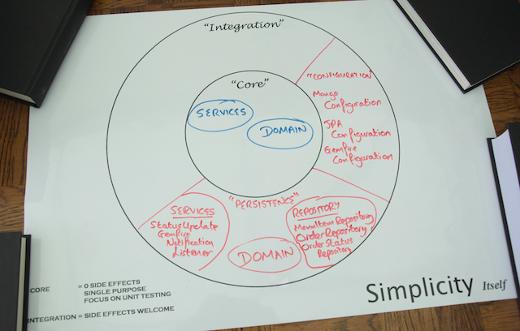

## Recap and where to go next?

You have successfully stored all of the Yummy Noodle Bar's data and made the application more robust and scalable at the same time.

Here's how far you've come, you've:

* Understood the different Data Models that MongoDB, JPA and GemFire cover and how they may affect your application.
* Built a Spring Data Mongo Repository to store and retrieve Menu data from MongoDB
* Used MongoTemplate to test the repository and also run a Map Reduce job to perform data analysis.
* Built a Spring Data JPA Repository to store and retrieve Order data from an H2 relational database.
* Configured and used JPA in a test to understand transactions and how a class is mapped to a JPA database.
* Built a Spring Data GemFire Repository to store and retrieve OrderStatus data from a GemFire CacheServer.
* Used GemfireTemplate to test the Repository and understand GemFire transaction handling.
* Created a GemFire Continuous Query to generate events across the application cluster

Your final Life Preserver shows all the components you've added within the Configuration and Persistence domains:

We hope you've enjoyed this tutorial! Check out the next steps in the navigation bar for what you might want to explore next.