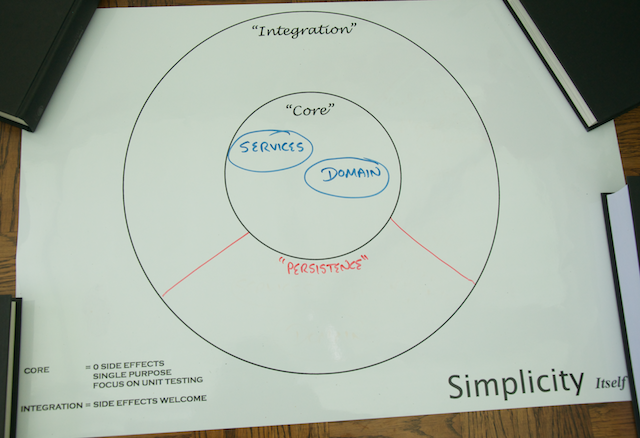

In this tutorial you'll use Spring to store and retrieve data from multiple data stores.

## Persistence and Storage

The field of Data Persistence has progressed enormously over the past 20 years. Not so long ago, if you were considering data storage and retrieval you were fairly limited to thinking in terms of a relational data store, or perhaps simple file storage. 

Today there are much richer options, and Data Persistence now covers a myriad of different data models and data storage implementations.

Since you're reading this tutorial, it's likely that you are considering implementing a data storage using a component referred to as a [Repository], a pattern from [Domain Driven Design](http://en.wikipedia.org/wiki/Domain-driven_design), because:

* You have a data store where you need to access and potentially modify the data that's stored.
* You have an existing [Spring Data](http://projects.spring.io/spring-data/) application that you need to maintain.
* You want to investigate different data stores in the context of Spring Data.

This tutorial covers three data stores: the [MongoDB](http://www.mongodb.org) document store, a relational database using [JPA](http://www.oracle.com/technetwork/java/javaee/tech/persistence-jsp-140049.html) and [Pivotal GemFire](http://gopivotal.com/pivotal-products/pivotal-data-fabric/pivotal-gemfire).

## What you'll build

The context for this tutorial is the Yummy Noodle Bar. As part of its planned expansion it needs to be able to store and update its Menu and store Orders.


You will extend the Yummmy Noodle Bar's application to:

- Store Menu data in MongoDB.
- Store Order data in a Relational Database.
- Track the Status of an Order using GemFire. 

> **Note:** More detail on the Yummy Noodle Bar's application is available in the next section of this tutorial.

[Spring Data](http://projects.spring.io/spring-data/) will provide the bedrock of your persistence project, and you will discover how it makes your data access simpler, more consistent and more robust.

## What you'll need

To work through this tutorial you'll need a few things:

* About a half hour for each section. You might finish it in a week during your lunch break (or during the weekend!)
* A copy of the code (available either by [git][u-git] or a [downloadable zip file](https://github.com/spring-guides/tut-data/archive/master.zip)).
* An IDE of your choice. Spring recommends [Spring Tool Suite](http://www.springsource.org/sts), which is a [free download](http://www.springsource.org/sts).
* An installation of [MongoDB](http://www.mongodb.org/)

### Downloading and running the code

If you download the code base, you'll discover each section of this tutorial in a separate folder, numbered 1, 2, 3, etc. There are also several code drops: an **initial** one at the root, and a separate **complete** code drop for each section.

The **initial** code set contains:
- a project layout
- the core domain & event classes this tutorial starts off creating (the 'Yummy Noodle Bar Application', above)
- some basic unit tests for some of those classes

The **complete** code set in each section includes the initial code base plus the code developed up to that point in the tutorial.

You can choose to start with the **initial** code set or you can start with the **complete** code set for a given section. Important files from each of the steps are shown in the tutorial, such as writing tests, creating data oriented interfaces services, and looking at some key domain objects.

This tutorial is built using [Gradle][gs-gradle] and includes the Gradle Wrapper, so you don't have to install anything to run the code.

For example, if you want to check out the initial code set:

```sh
$ git clone git@github.com:spring-guides/tut-data.git
$ cd tut-data/initial
$ ./gradlew clean test
```

From there, you can inspect `build/reports/tests` and see all the test results.

[u-git]: /understanding/Git
[gs-gradle]: /guides/gs/gradle

## The Home of Persistence in your Application Architecture

Repositories are an integration between your core application and external, persistent storage engines. Repositories can be seen as living in their own Persistence integration domain on the periphery of your applications core as shown in the following diagram:



As an integration between your application core and the outside world there are a number of concerns that need to be addressed in the design and implementation of the components that make up your Repositories:

* The primary purpose of a Repository component is to integrate your application with the data stores in a natural and optimised  (for data storage and retrieval) way.
* Components of your persistence domain will need to evolve at a rate that is appropriate for the data they are managing.
* Your Repository components should not contain any core logic. They should instead focus on collaborating with other components in the core domain of your application in order to support their core functionality.

That's enough on the design constraints placed on the components that implement your Repositories, the rest of this tutorial looks at how to implement those components using Spring:

* [Step 1: Understanding the Core & Persistence Domains and the Relationships between them](1/)
* [Step 2: Storing Menu Data Using MongoDB](2/)
* [Step 3: Storing Order Data Using JPA](3/)
* [Step 4: Storing the Order Status in GemFire using Spring Data GemFire](4/)
* [Step 5: Extending the Persistence Domain to Send Events](5/)
* [Recap and Where to go Next?](6/)

